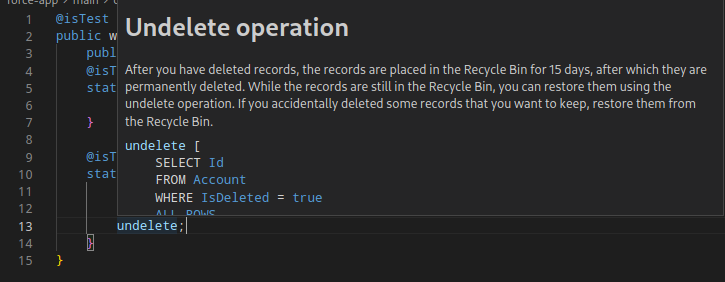

# Hi there 👋

Im currently studing and working, so I might be slow to reply.

Sneak peak into my current project:

# Projects

## SFDX Plugins

### For better autocompletion

- [Plugin for better SObjects typings generation](https://github.com/Ziemniakoss/apex-typings-generator)
- [Plugin for better lwc typings generation](https://github.com/Ziemniakoss/lwc-typings-generator)

### Metadata management

- [Plugin for splitting and merging metadata files](https://github.com/Ziemniakoss/sfdx-metadata-splitter)
- [Plugin for metadata manipulation](https://github.com/Ziemniakoss/sfdx-metadata-utils)

### Other

- [Plugin helping with cpq custom scripts deployment](https://github.com/Ziemniakoss/sfdx-cpq-scripts-deployment)
- [Plugin for notifications](https://github.com/Ziemniakoss/sfdx-notifications)
- [Plugin for deployment summary report generation](https://github.com/Ziemniakoss/sfdx-ci-summary-creator)
